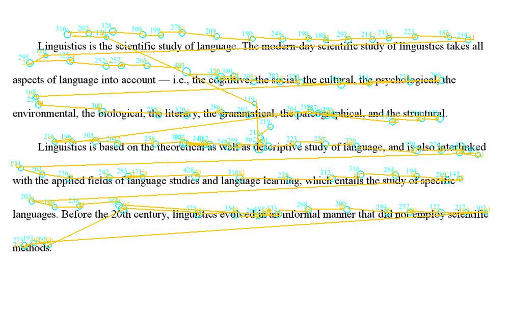
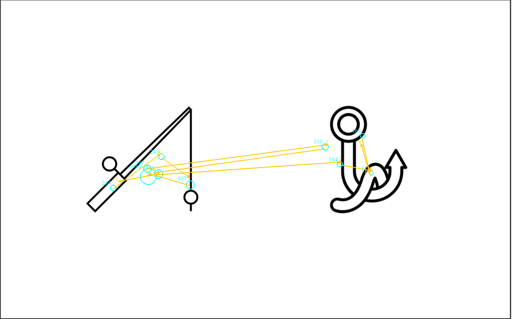
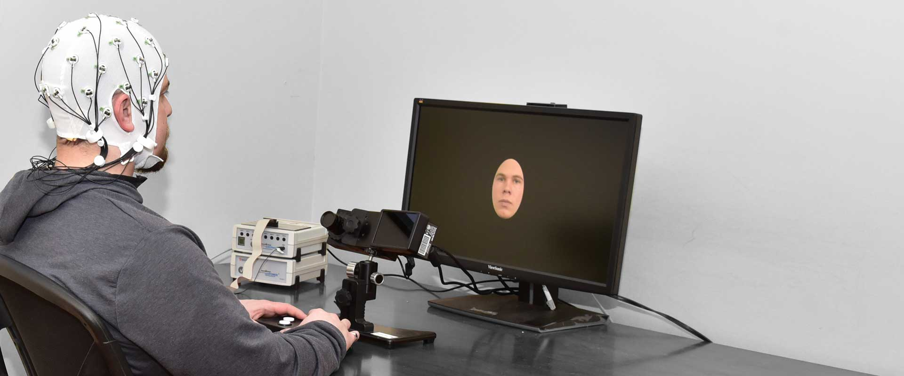
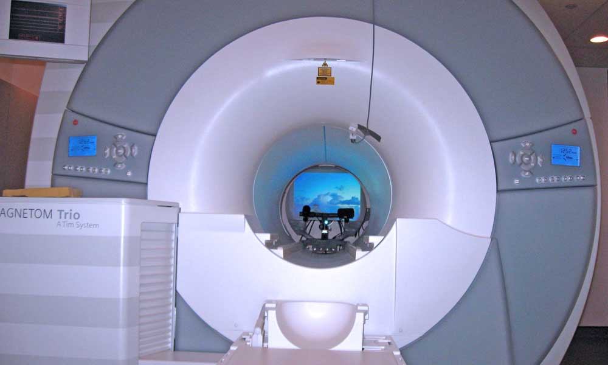

\pagestyle{fancy}
\lhead{}
\fancyhead[R]{UCL Linguistics Autumn School 2023}

Eye-tracking is a very popular tool in psychology, and is becoming more and more popular in psycholinguistics, as well. Although eye-tracking does not provide direct measurements of neural activity, it allows researchers to gain insight into human cognition and attention. 

In these few days, I will give you an introduction to the eye-tracking method and its application in research on reading as well as spoken language processing. On day 4 I will invite Kayla to talk about pupillometry, eye-tracking's cousin method, and its application to language research. For day 5, I will bring a demo experiment to the class before answering your questions and/or tell you a bit more about what you are interested. 

# How eye-tracking works

## The human visual system

Let's start with some basics about human vision. The human eye collects and filters light energy in the environment. The light energy then hits the retina and gets transformed into neural signals by specialized receptor cells on the retina. What's important for us here is that the receptor cells are not equally distributed across the retina: receptors responsible for detailed vision in light (called cones) are the most densely distributed at the fovea, where vision is the clearest/sharpest (i.e. where **visual acuity** is the highest). Only a small proportion of the visual field lands on the fovea (about 1-2 degrees of vision), and visual acuity falls off rapidly the further away from the fovea. Lessened acuity outside the fovea means that we must frequently move our eyes - and therefore the direction of gaze - to different positions in the visual space to have a good visual perception. 

## Types of eye movements

Eye movements can be classified into three types: **fixations**, **saccades**, and smooth pursuit. 

Fixation is the maintaining of the gaze on a single location, during which the brain processes the current visual focus in detail^[The gaze is not completely still during fixation, but rather characterised by fixational eye movements such as microsaccades and ocular drifts. These small movements help prevent sensory adaptation (i.e. they help prevent the retina from getting "too used to" the input), thus help maintain sharp visual perception.]. Saccades refer to the rapid movements that shift the center of gaze from one part of the visual field to another, aligning the fovea with the saccade target. Saccades are considered ballistic, because they always have a pre-determined target which cannot be changed once the saccade is initiated. Regular eye movements alternate between fixations and saccades. Smooth pursuit or pursuit is a special case of eye movement where the gaze tracks a moving object smoothly. 

A modern eye-tracker can classify these eye movements on the fly during data collection, and researchers can choose to subsequently analyse data from specific type(s) of eye movements of their interest. 

## Modern eye-tracking techniques

The device used to track eye movements is called an eye tracker. In general, there are two types of eye movement monitoring techniques: those that measure the position of the eye relative to the head, and those that measure the orientation of the eye in space (the point of regard). The latter measurement is typically used when the concern is the identification of elements in a visual scene and is the more relevant one to language research. 

Today, the most popular (laboratory) eye movement measurement technique is the video-based corneal reflection eye tracker^[The eye trackers in the Chandler House labs are all of this type.]. Video-based corneal reflection eye trackers use corneal reflection of a light source (usually infra-red) and the pupil center to disambiguate head movement from eye rotation, in order to measure the point of regard. 

{width=45%}

{width=45%}

Eye tracking is the measurement of eye movements, but modern eye trackers can often provide more data than that. A good example is pupil size. Although not part of eye movements, pupil size is closely associated with various psychological constructs such as arousal, emotion, cognitive load, and memory. The measurement of pupil size is called pupillometry, and is being used in psychology-related research fields including language. 

Outside the laboratories, eye-tracking techniques have evolved to enable eye-tracking using cameras incorporated in laptops, cell phones, and glasses. These techniques are being applied in online/real-world research as well as in various industries such as marketing and gaming. 

# Eye-tracking and visual attention

How can eye movements be associated with cognition? In simple words, our eye movements are highly correlated with our visual attention, and attention allows us to selectively process the vast amount of information that confronts us. By tracking eye movements, we follow along the path of attention deployed by the observer, and get insights into what the observer is processing at the time.  (Eye movements and the shift of visual attention are correlated but not equivalent, because visual attention is not always at the center of the visual field: planning a saccade usually requires shifting visual attention to the saccade target first. It's also possible for humans to deliberately attend to something in our peripheral vision.) Nevertheless, during natural, unconstrained eye movement, there is a strong link between visual attention and eye movements [@richardson2004eye]. 

How are these coupled mechanisms of attention and eye movement deployed when a scene is viewed? First, fixations usually center on interesting/informative areas of an image, while blank or uniform areas are usually uninspected. Wooding and colleagues collected real-life eye movement data from a large number of participants viewing artworks in a public museum, and discovered that fixations are not spread evenly or randomly over the stimulus images, but cluster into regions of interest according to the features of the stimulus [@wooding2002eye] (Figure \ref{wooding-fig2}). Regions of interest are determined by both bottom-up factors such as spatial frequency and contrast, and top-down factors such as the viewer's knowledge, memory, beliefs, or goals. 

{width=65%}

# Applications of the eye-tracking method in language research

## Reading

{width=45%}

Reading is perhaps the first instance anyone can think of where vision is required for language, and indeed eye-tracking is widely used in research on reading. 

During reading, a saccade usually spans over seven to nine letter spaces. On an individual word, fixation usually lands between the beginning and the middle of the word. Chances of an individual word being fixated on depend on many factors, such as parts of speech (content vs. function words) and word length. While fixating on a word, the reader also gathers information about surrounding words. This perceptual span usually extends around 18 letters, about 3-4 letters to the left and 14-15 letters to the right (when the language is written left to right). 

Fixation pattern during reading is also affected by factors such as legibility and syntactic and conceptual difficulty. Although readers typically move their eyes forward during reading, a proportion of saccades move backwards as well. These regressive saccades are associated with processing difficulties during reading. 

There is a large individual difference in terms of eye movement patterns during reading. This individual difference means that reading eye-tracking has many practical applications in education psychology, including distinguishing successful and unsuccessful students and the diagnosis of reading disorders such as dyslexia. 

## Spoken language processing in a visual scene

{width=45%}

The use of eye tracking as a tool to study spoken language comprehension was pioneered by Roger Cooper in 1974, who found that listeners initiated saccades to pictures that were named in spoken stories. In 1995, Tanenhaus and colleagues initiated what's called the visual world paradigm, where participants are presented with objects in a visual display while listening to instructions to interact with these objects or simply listening to sentences for comprehension. 

In the visual world paradigm, data analysis usually involves analysing the proportion of fixations over time for each object in the visual display. The assumption providing the link between word recognition and eye movements is that the activation of the name of a picture determines the probability that a subject will shift attention to that picture and thus make a saccadic eye movement to fixate it. The visual world paradigm provides a (quasi-)continuous measure of cognition that has a fine temporal resolution, and has contributed a lot to our understanding of the time course of language comprehension. 

The visual world paradigm has been used to study lexical activation during spoken word recognition, and has provided evidence for listeners sensitivity to lexical stress, duration of acoustic sequences, pitch accents, lexical tones, etc. At the sentence level, the visual world paradigm is widely used to study syntactic parsing, semantic integration, discourse processing, and most importantly predictive processing during language comprehension. 

## Combining eye-tracking and neuroimaging

Experimental research benefits from the complementarity of its research methods: each method has its strengths and limitations, so the results obtained from multiple techniques are more compelling than results derived from only a single approach. In this sense, eye-tracking results can be discussed together with results from other techniques such as electroencephalography (EEG)^[Electroencephalography (EEG) measures the brain's electrical activity ("brain waves") from the scalp. EEG has high temporal resolution and can measure neural activity on the millisecond scale. In cognitive neuroscience and related fields, researchers are often interested in the brain's response to a stimulus. The brain's response relative to the onset of an event (e.g. presentation of a stimulus) is called Event-related potentials (ERPs).] and functional magnetic resonance imaging (fMRI)^[Magnetic resonance imaging uses nuclear magnetic resonance to produce detailed images of body tissues. (Basically it measures the distribution of hydrogen in the body and uses it to calculate images.) Functional MRI (fMRI) uses a version of these MR signals and measures the brain's neural activity by measuring changes in the brain's blood flow associated with neural activities. fMRI's high spatial resolution enables researchers to ask very detailed "where" questions on the millimeter scale (e.g. is there an area in the brain that's specialized in syntax/semantics?). ] to support a hypothesis. For example, there are both eye-tracking evidence and EEG evidence showing that a comprehender uses contextual information to anticipate upcoming words in constraining contexts such as "They wanted to make the hotel look more like a tropical resort. So along the driveway, they planted rows of *palms*". Eye-tracking results show that comprehenders often make anticipatory saccades towards the target object in constraining contexts, and EEG methods show that neural response to an expected word is reduced compared to unexpected words (because the expected word was already pre-activated by the context). 

Recently, developments in technology and data analysis method have started to allow researchers to co-register eye movements and EEG/fMRI data. In this case, eye-tracking can open up new opportunities for these neuroimaging techniques and allow them to measure neural activity in highly natural tasks. Here, eye movements provide information on what is being looked at, and EEG or fMRI data provide information on the brain's response to that visual information. Co-registration of eye-tracking and EEG was pioneered in the first decade of this century, and studies of eye-tracking EEG co-registration during natural reading started to publish in the 2010s. Using eye movement patterns as an anchor, researchers have successfully replicated in natural reading a few EEG effects (e.g. effect of expected vs. unexpected words) in fixation-related potentials (FRPs) that were previously only possible to obtain with carefully-controlled laboratory stimuli presentation methods [@dimigen2011coregistration]. Co-registration of eye-tracking and fMRI has also been possible since the 2010s, with applications to language research emerging in recent years on topics such as syntactic parsing and lexical activation during natural reading. For example, Carter et al. @carter2019linguistic reported that a word's different types of predictability (syntactic, semantic, and lexical) are associated with different regions in the brain's language system. 

{width=45%}

{width=45%}

# Read more on this... {-}

Richardson, D. C., & Spivey, M. J. (2004). Eye tracking: Research areas and applications. *Encyclopedia of biomaterials and biomedical engineering*, 573, 582.

Carter, B. T., & Luke, S. G. (2020). Best practices in eye tracking research. *International Journal of Psychophysiology*, 155, 49-62.