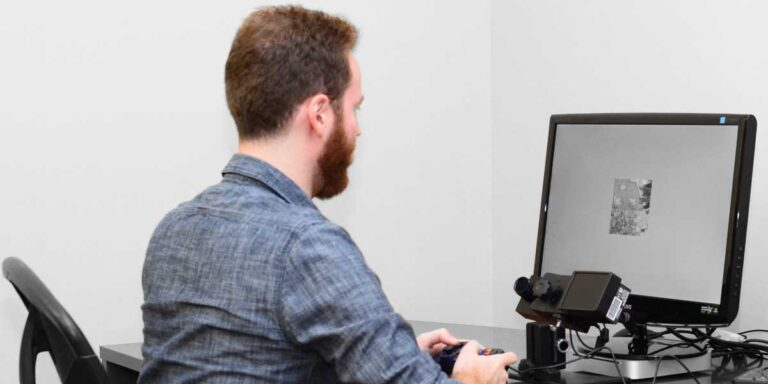
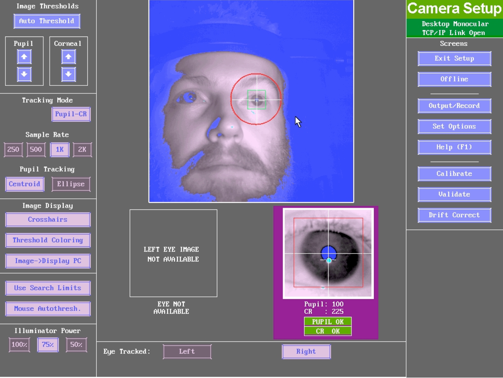

# How eye-tracking works

## The human visual system

Let's start with some basics about human vision. The human eye collects and filters light energy in the environment. The light energy then hits the retina and gets transformed into neural signals by specialized receptor cells on the retina. What's important for us here is that the receptor cells are not equally distributed across the retina: receptors responsible for detailed vision in light (called cones) are the most densely distributed at the fovea, where vision is the clearest/sharpest (i.e. where **visual acuity** is the highest). Only a small proportion of the visual field lands on the fovea (about 1-2 degrees of vision), and visual acuity falls off rapidly the further away from the fovea. Lessened acuity outside the fovea means that we must frequently move our eyes - and therefore the direction of gaze - to different positions in the visual space to have a good visual perception. 

## Types of eye movements

Eye movements can be classified into three types: **fixations**, **saccades**, and pursuit. 

Fixation is the maintaining of the gaze on a single location, during which the brain processes the current visual focus in detail^[The gaze is not completely still during fixation, but rather characterised by fixational eye movements such as microsaccades and ocular drifts. These small movements help prevent sensory adaptation (i.e. they help prevent the retina from getting "too used to" the input), thus help maintain sharp visual perception.]. Saccades refer to the rapid movements that shift the center of gaze from one part of the visual field to another, aligning the fovea with the saccade target. Saccades are considered ballistic, because they always have a pre-determined target which cannot be changed once the saccade is initiated. Regular eye movements alternate between fixations and saccades. Smooth pursuit or pursuit is a special case of eye movement where the gaze tracks a moving object smoothly. 

A modern eye-tracker can classify these eye movements on the fly during data collection, and researchers can choose to subsequently analyse data from specific type(s) of eye movements of their interest. 

## Modern eye-tracking techniques

The device used to track eye movements is called an eye tracker. In general, there are two types of eye movement monitoring techniques: those that measure the position of the eye relative to the head, and those that measure the orientation of the eye in space (the point of regard). The latter measurement is typically used when the concern is the identification of elements in a visual scene and is the more relevant one to language research. 

Today, the most popular (laboratory) eye movement measurement technique is the video-based corneal reflection eye tracker^[The eye trackers in the Chandler House labs are all of this type.]. Video-based corneal reflection eye trackers use corneal reflection of a light source (usually infra-red) and the pupil center to disambiguate head movement from eye rotation, in order to measure the point of regard. 

{width=45%}   {width=45%}

Eye tracking is the measurement of eye movements, but modern eye trackers can often provide more data than that. A good example is pupil size. Although not part of eye movements, pupil size is closely associated with various psychological constructs such as arousal, emotion, cognitive load, and memory. The measurement of pupil size is called pupillometry, and is being used in psychology-related research fields including language. 

Outside the laboratories, eye-tracking techniques have evolved to enable eye-tracking using cameras incorporated in laptops, cell phones, and glasses. These techniques are being applied in online/real-world research as well as in various industries such as marketing and gaming. 

# Applications of the eye-tracking method (before language)

I will briefly cover some areas of application outside of language. Findings in these areas sometimes become the basis or the assumptions underlying the application of eye-tracking methods in language research. 

## Visual attention and visual perception

Attending to a location in space aids processing of stimuli at that location. However, visual attention is not always at the center of the visual field. Planning a saccade usually requires shifting visual attention to the saccade target first. It's also possible for humans to deliberately attend to something in our peripheral vision. Nevertheless, during natural, unconstrained eye movement, there is a strong link between visual attention and eye movements. 

# Applications of the eye-tracking method in language research

## Reading

## Spoken language processing in a visual scene

## Communication or language in social context

## Sign languages

